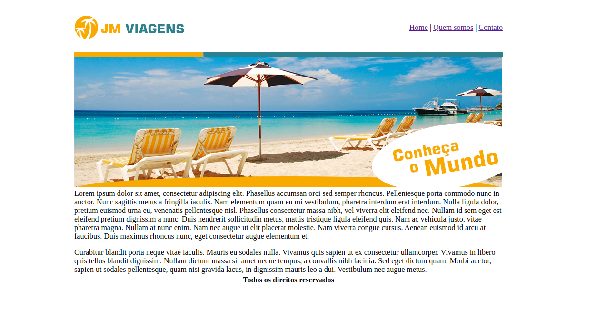

<hr>

# Projeto JM Viagens

Bem-vindo ao Projeto JM Viagens! 🚀 Este é um repositório dedicado ao projeto Projeto JM Viagens, Projeto realizado como exercício ao "Recriando a página inicial do Instagram".

## Descrição

Projeto JM Viagens é uma aplicação web que recria a interface de uma assessoria de viagens. Este repositório contém o código-fonte e os arquivos essenciais para executar a aplicação em sua máquina local.

## Funcionalidades Principais

- 🌐 Recriação da interface de viagens
- 📚 Recursos Interativos
- 💻 Ambiente de Desenvolvimento Integrado (IDE)

## Instruções de Instalação

Siga estas etapas para configurar o Projeto JM Viagens em sua máquina:

1. **Clone o Repositório:**

   ```bash
   git clone https://github.com/devbdallagnol/projeto-jmviagens_html_css
   ```

2. **Crie o ambiente virtual:**

   ```bash
   abra o arquivo index.html no navegador
   ```

### Contribuição

Contribuições são bem-vindas! Se você deseja melhorar o projeto, siga estas diretrizes:

1. Faça um Fork do projeto
2. Crie uma nova branch `git checkout -b feature/nova-feature`
3. Faça commit das suas alterações `git commit -am 'Adiciona nova feature'`
4. Faça push para a branch `git push origin feature/nova-feature`
5. Abra um Pull Request

### Contato

Se precisar de ajuda ou tiver alguma dúvida, sinta-se à vontade para entrar em contato:

Desenvolvedor: @devbdallagnol
